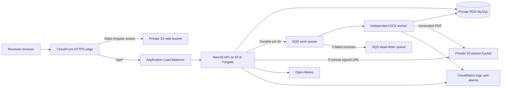

<p align="center">
  
</p>

<h1 align="center">Bandboard</h1>

<p align="center">
  An enterprise-shaped operations platform for the controlled chaos of a collegiate marching band.
</p>

<p align="center">
  <a href="https://d1vlahcgbfcf5u.cloudfront.net"><strong>Launch the live AWS demo</strong></a>
  ·
  <a href="docs/ARCHITECTURE.md">Architecture</a>
  ·
  <a href="docs/RUNBOOK.md">Runbook</a>
  ·
  <a href="docs/FINISHER_REPORT.md">Readiness report</a>
</p>

<p align="center">
  
  
  
</p>

Bandboard turns one understandable operational problem into a full-stack systems demonstration. A tenor sax player becomes unavailable shortly before a fictional Homecoming performance. The coordinator must find a qualified substitute, resolve the travel conflict, publish a new event revision, generate an offline packet, notify members, and prove that the change was acknowledged.

That single story crosses the browser, API, relational database, transaction boundary, durable queue, independent worker, private object storage, generated PDF, audit trail, monitoring, recovery path, and deployment pipeline.

> This is a public portfolio demonstration built entirely with synthetic people, events, assignments, and documents. It is not affiliated with or endorsed by Cornell University.

## What you can do

### Coordinator experience

- Start from a deliberately broken **82% readiness** state with three visible blockers.
- Assign the best qualified substitute and resolve music, equipment, and transportation constraints in one transaction.
- Change member availability, reorder repertoire, and report equipment damage.
- Publish revision 4 and watch three durable jobs move through queued, processing, and complete states.
- Inspect operational history, job attempts, actor-attributed audit events, and packet metadata.
- Download a real one-page event packet through a five-minute signed S3 URL.
- Trigger a controlled worker failure, observe three delivery attempts and DLQ redrive, then replay the same durable job.
- Reset every mutation back to the canonical 82% opening state.

### Member experience

- Switch perspectives instantly without juggling demo credentials.
- See a focused itinerary, assignment, equipment, and “bring with you” view.
- Review the newly generated packet and acknowledge the published revision.
- See the acknowledgment reflected in coordinator readiness.

### Live integration

Weather for Schoellkopf Field comes from Open-Meteo through the NestJS API—not directly from the browser. The adapter normalizes the provider response, caches it for ten minutes, applies a short timeout, and returns an explicit fallback state if the upstream service is unavailable.

## Five-minute reviewer script

1. Open the [live demo](https://d1vlahcgbfcf5u.cloudfront.net) and inspect the 82% readiness ring and three blockers.
2. Select **Assign** for Alex Rivera. Confirm that coverage and travel resolve together.
3. Select **Publish revision**. Open **Operations** and watch packet generation, notification, and readiness jobs complete asynchronously.
4. Download the packet and confirm it is a generated PDF—not a static fixture.
5. Switch to **Member**, acknowledge revision 4, then return to **Coordinator** to see the state change.
6. Under **Operations**, run the recovery drill. Watch attempts 1–3 fail, then use **Retry** to replay the durable job successfully.
7. Select **Reset demo** to restore the opening case.

For a deeper pass, use **People**, **Repertoire**, and **Equipment** to mutate data and verify that the audit trail records each action.

## Architecture



CloudFront is the only public application entry point. Static assets come from a private origin-access-controlled S3 bucket. `/api/*` requests pass through an ALB whose security group admits only the AWS-managed CloudFront origin-facing prefix list. RDS is non-public. API and worker use separate least-privilege task roles.

CI recreates the same MySQL, S3, SQS, worker, and web contracts in an isolated runner, so the infrastructure workflow is tested on every change without exposing cloud credentials.

## The stack

| Layer | Technology | What it demonstrates |
| --- | --- | --- |
| Frontend | Angular 20, Angular Material, SCSS | Responsive coordinator/member UX, accessibility semantics, loading/error states |
| API | NestJS, Swagger/OpenAPI, class-validator | REST design, DTO validation, role guard, throttling, health checks, request IDs |
| Data | MySQL 8.4, TypeORM | Checked-in migrations, relationships, transactions, audit history; synchronization disabled |
| Async work | Amazon SQS, separate Nest worker | Durable jobs, idempotency, three-attempt retry, DLQ redrive, operator replay |
| Documents | PDFKit | Generated offline event packet with revision and integrity metadata |
| Storage | Private Amazon S3 | Encrypted objects, deterministic keys, SHA-256 checksum, signed downloads |
| Cloud | CloudFront, ALB, ARM64 ECS Fargate, RDS, S3, SQS, Secrets Manager | Managed HTTPS deployment with private state and independently deployed compute |
| Operations | CloudWatch, AWS Budgets | Central logs, queue-age/DLQ/unhealthy-target alarms, monthly cost tracking |
| Delivery | CloudFormation, ECR, GitHub Actions OIDC | Repeatable infrastructure, immutable images, no stored AWS keys, circuit-breaker rollback |
| CI simulation | Docker Compose, Nginx, LocalStack, GitHub Actions | Isolated end-to-end infrastructure-contract testing on every change |

## How to evaluate it remotely

Nothing needs to be installed. The portfolio environment is live, seeded, and resettable.

| What to test | How to test it | What it proves |
| --- | --- | --- |
| Opening case | [Launch Bandboard](https://d1vlahcgbfcf5u.cloudfront.net) | Public HTTPS delivery, live API state, correct 82% readiness visualization |
| Business transaction | Assign Alex Rivera from **Needs attention** | Server-owned qualification rules, relational update, travel and coverage resolution |
| Durable workflow | Publish revision 4, then open **Operations** | API returns before three independent SQS jobs complete in the worker |
| Private artifact | Download the generated event packet | PDF generation, private S3 storage, short-lived signed retrieval |
| Two user perspectives | Switch to **Member** and acknowledge revision 4 | Purposeful demo-role UX and state shared through the API/database |
| Failure recovery | Run **Recovery drill**, observe three attempts, then select **Retry** | SQS retry, DLQ redrive, visible failure state, operator replay |
| Supporting modules | Change availability, reorder repertoire, report equipment condition | Functional sections, validation, audit attribution, persistent state |
| Clean restart | Select **Reset demo** | Deterministic return to the canonical 82% scenario |
| Service health | [Open the public health endpoint](https://d1vlahcgbfcf5u.cloudfront.net/api/demo/health) | CloudFront → ALB → ECS API → RDS health path |
| Delivery evidence | [Inspect GitHub Actions](https://github.com/capo689/Cornell/actions/workflows/ci.yml) | Current build, tests, container workflow, audit gate, and secret scan |

### Automated evidence

| Gate | Coverage |
| --- | --- |
| API unit tests | Business rules, weather normalization/fallback, PDF structure, worker success/failure behavior |
| API e2e tests | Health, validation, coordinator-only mutation, unresolved publish rejection |
| Angular browser tests | Coordinator/member rendering and interaction contracts in headless Chrome |
| Compose integration | MySQL migration, LocalStack S3/SQS, worker, signed PDF, DLQ, replay |
| Secret scan | Full-history Gitleaks scan |
| Dependency gate | Fails CI on high or critical audit findings |

The repository's [live AWS verification script](scripts/verify-aws-workflow.sh) exercises the complete managed path against CloudFront, RDS, SQS, the independent Fargate worker, and private S3. It validates the downloaded PDF signature, observes a real DLQ increase, replays the durable job, then restores the public demo and purges the synthetic drill message.

## Deployment and rollback

Initial AWS deployment:

```bash
AWS_PROFILE=bandboard-deploy AWS_REGION=us-east-1 ./scripts/deploy-aws.sh
```

CloudFormation creates the registry, GitHub OIDC provider, budget, private buckets, SQS/DLQ, RDS, ALB, CloudFront distribution, task roles, ECS services, logs, and alarms. The deployment script builds an immutable ARM64 image, publishes Angular assets with explicit cache policies, and waits for the public health endpoint.

After bootstrap, merges to `main` deploy through short-lived GitHub OIDC credentials. ECS deployment circuit breakers automatically roll back unhealthy revisions. An operator can also manually run **Deploy Bandboard** with a known-good ECR image tag for an explicit application rollback.

See [AWS deployment and operations](docs/AWS_DEPLOYMENT.md) for commands, cost boundaries, logs, and limitations.

## Security and scope decisions

- All repository and live-demo data is synthetic.
- The role switcher is intentionally frictionless for reviewers. It demonstrates the authorization seam but is **not authentication**.
- Coordinator mutations are still enforced by a NestJS guard; hiding a button is never treated as authorization.
- RDS is non-public, packet objects are private, and database credentials are managed by Secrets Manager.
- Browser responses receive security headers; API requests receive validation, throttling, CORS policy, and request IDs.
- GitHub Actions assumes a repository- and branch-scoped AWS role. No long-lived AWS credential is stored in GitHub.

Before real operational use, add institutional OIDC, server-derived actor claims, privacy/retention governance, verified alarm ownership, WAF/distributed rate limiting, restore exercises, and an incident process. The explicit boundary and scored gaps are documented in the [FINISHER report](docs/FINISHER_REPORT.md).

## Repository map

```text
apps/web/                 Angular coordinator and member application
apps/api/                 NestJS API, worker, entities, migrations, tests
infra/aws/                CloudFormation bootstrap and application stacks
infra/localstack/         Local S3/SQS/DLQ initialization
scripts/                  Local and AWS deploy/status/workflow proofs
.github/workflows/        CI plus OIDC deployment and rollback
docs/                     Architecture, runbook, ADR, deployment, readiness
docker-compose.yml        Complete local production-shaped environment
```

## Design note

The visual system and supplied event artwork establish a Big Red portfolio concept. They are used only for this synthetic demonstration and do not imply university affiliation, sponsorship, or endorsement.
