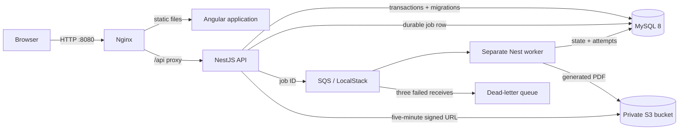

# Bandboard architecture

## Scope

Bandboard is a Level 0, synthetic-data portfolio demo. It demonstrates an enterprise-shaped workflow without claiming a production identity system, live university integration, or deployed cloud infrastructure.

## Components and ownership

- Angular owns presentation state, responsive coordinator/member views, loading and error feedback, and accessibility semantics. It does not decide authorization or readiness.
- NestJS owns validation, the coordinator guard, readiness and qualification rules, workflow ordering, audit events, and queue submission.
- MySQL is the source of truth for event, member, repertoire, instrument, audit, and job state. TypeORM runs a checked-in migration; schema synchronization is disabled.
- Nginx serves the compiled application and proxies `/api` to NestJS.
- The API owns durable job creation and SQS submission. The worker is a separate process with its own lifecycle and updates queued, processing, retrying, failed, and complete states.
- PDFKit creates a one-page offline packet. S3-compatible storage is private; the database stores object key, byte size, SHA-256 checksum, and revision metadata.
- LocalStack provisions the bucket, main queue, three-receive redrive policy, and DLQ so development and CI exercise the AWS SDK paths without cloud credentials.

## Trust boundaries

All names and assignments are fictional. `x-demo-role` and `x-demo-user` are presentation aids, not trustworthy identity. The API does enforce coordinator-only routes against those headers so the authorization seam is visible, but any caller can forge them. A public deployment must replace the headers with validated OIDC access tokens and server-derived claims.

The database is private to the Compose network. Only Nginx exposes a host port. Browser-facing API responses receive Helmet headers, request IDs, validation, CORS policy, and a 100-request-per-minute in-process rate limit.

## Data lifecycle

`POST /api/demo/reset` removes generated packet objects and mutable demo records, restores event revision 3, and reseeds members, charts, and instruments. Publishing is idempotent, and packet keys are deterministic per event revision. Assignment uses one database transaction; queue records and audit entries make workflow effects inspectable. A controlled recovery drill fails three times, reaches the DLQ, and can be replayed from the same job row by an operator.

## Decisions

Architectural decisions are recorded under [`docs/adr`](adr/0001-demo-identity-boundary.md).
