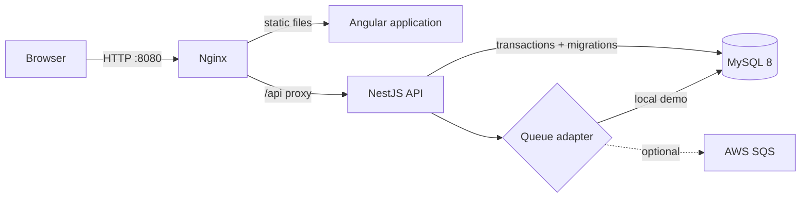

# Bandboard architecture

## Scope

Bandboard is a Level 0, synthetic-data portfolio demo. It demonstrates an enterprise-shaped workflow without claiming a production identity system, live university integration, or deployed cloud infrastructure.

## Components and ownership

- Angular owns presentation state, responsive coordinator/member views, loading and error feedback, and accessibility semantics. It does not decide authorization or readiness.
- NestJS owns validation, the coordinator guard, readiness and qualification rules, workflow ordering, audit events, and queue submission.
- MySQL is the source of truth for event, member, repertoire, instrument, audit, and job state. TypeORM runs a checked-in migration; schema synchronization is disabled.
- Nginx serves the compiled application and proxies `/api` to NestJS.
- The queue adapter completes jobs synchronously into MySQL when `SQS_QUEUE_URL` is absent. With that variable configured it submits SQS messages, but a production worker is not included in this demo.

## Trust boundaries

All names and assignments are fictional. `x-demo-role` and `x-demo-user` are presentation aids, not trustworthy identity. The API does enforce coordinator-only routes against those headers so the authorization seam is visible, but any caller can forge them. A public deployment must replace the headers with validated OIDC access tokens and server-derived claims.

The database is private to the Compose network. Only Nginx exposes a host port. Browser-facing API responses receive Helmet headers, request IDs, validation, CORS policy, and a 100-request-per-minute in-process rate limit.

## Data lifecycle

`POST /api/demo/reset` clears mutable demo records, restores event revision 3, and reseeds members, charts, and instruments. Publishing is idempotent. Assignment uses one database transaction; queue records and audit entries make workflow effects inspectable.

## Decisions

Architectural decisions are recorded under [`docs/adr`](adr/0001-demo-identity-boundary.md).
